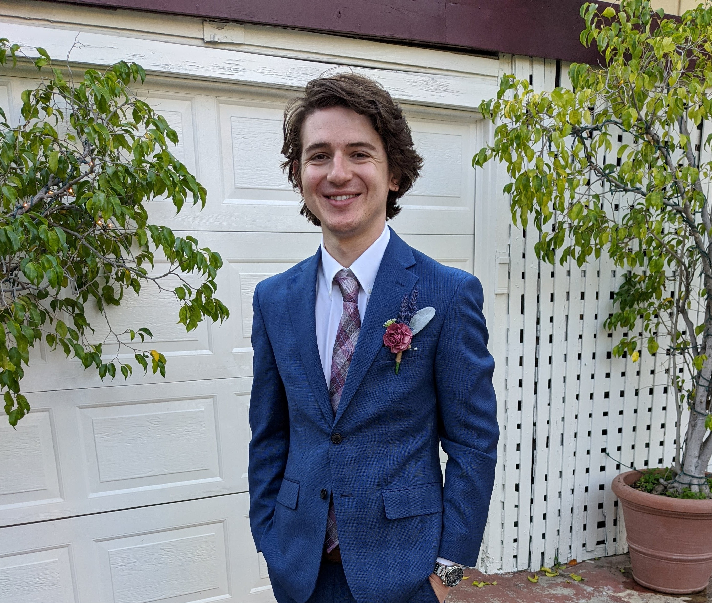

# Resume

## Cameron Hall

## Education

- **Rancho Buena Vista High School**: Diploma (2008-2012)

- **MiraCosta College**: AA Computer Science in Progress (2016-Curerent)

 
## Skills

- **Primary Languages**: Java, Python

- **Secondary Languages**: C++

- **Operating System**: Windows, Linux (Ubuntu)

- Experience building and maintaining hardware

- 7+ years of customer service 

## Professional Experience

- Bob's Steak and Chop House - Busser (2019-current)

- 333 Pacific Steaks and Seafood (Cohn Restaurant Group) — Runner/Expo (2017-2020)

- Cold Stone Creamery - Shift Lead (2012 - 2018)

 Extensive interactions in customer service
 Leadership experience in Shift Lead
 

## Programming Experience

- Writing discord bots for ease of life on a server I am apart of

- Party to developing tournament management software with a peer

## Projects

- **Unbeatable Tic-Tac-Toe** with fully implemented AI

- **Database Maintence System** that can pull, read/write, and push files back to a database
